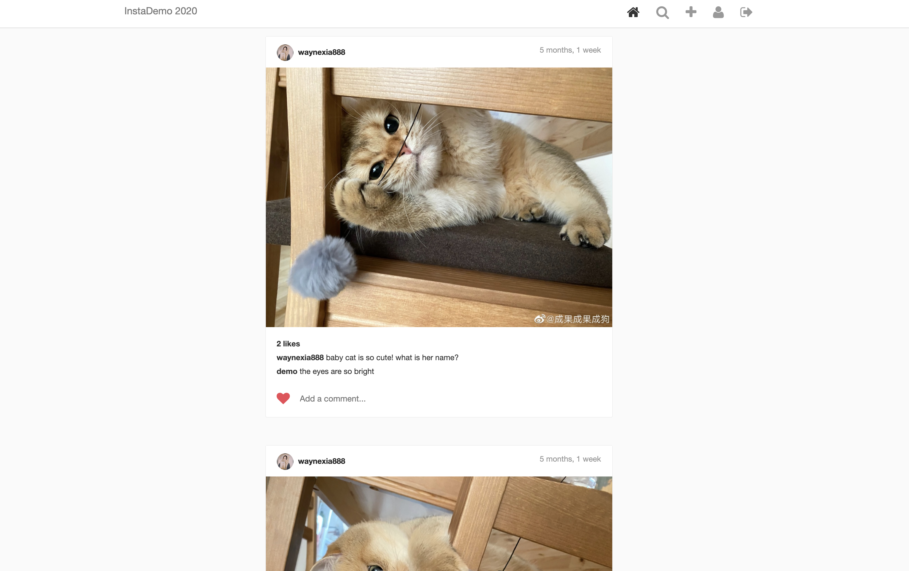
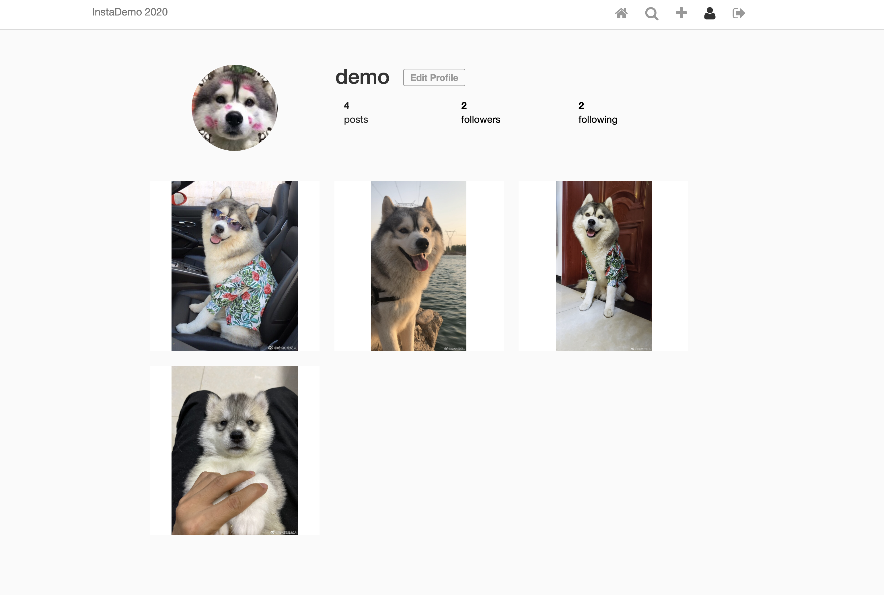

# InstaDemo-2020
[InstaDemo 2020](https://boiling-hamlet-70586.herokuapp.com/) is a minimal backend project(inspired by instagram) in Django, and it is also a social application that allow users to share, edit and comment photos. 

[Live Demo](https://stracker-app-50523.herokuapp.com/#/)   Username: `demo`; Password: `123zxc456`;   
   
   

## Technologies Used

- Django Framework
- Python
- SQLite database
- JavaScript
- Ajax
- Sass

## Current Features

- Custom photo feed based on who you follow
- Post photo posts
- Like/Unlike posts
- View all likes on a post
- Comment on posts
- View all comments on a post
- follow/unfollow users
- Profile Screen
- Edit profile
- search the user you followed

## Future Changes
- chat with users
- share short videos
